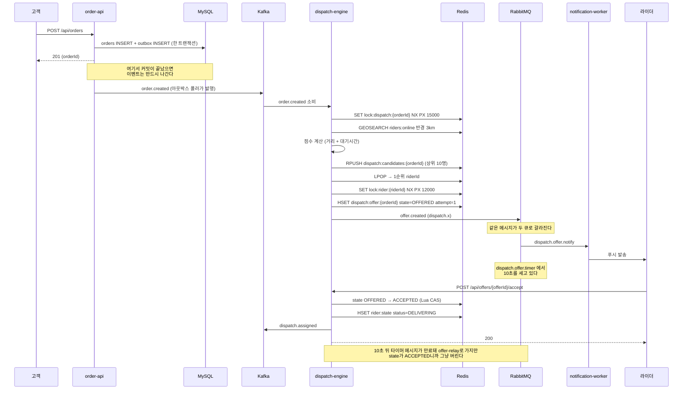
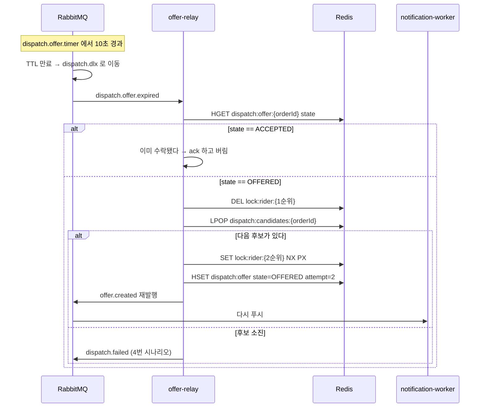

# 흐름 시나리오

주문 하나가 들어와서 배차되고 정산까지 가는 동안 무엇이 어디로 흐르는지 정리한 문서다.
설계 결정을 여기 모아두는 게 목적이라, 시나리오마다 "이렇게 흐른다"에 이어서
**왜 이렇게 짰는지**와 **어디서 깨질 수 있는지**를 같이 적었다.

확장 실험은 별도 문서에 있다. [`scaling-scenarios.md`](scaling-scenarios.md)

## 읽는 방법

표기는 이렇게 통일했다.

- `토픽명` 은 카프카 토픽이다. 괄호 안은 파티션 키.
- `큐명` 은 래빗엠큐 큐다. 익스체인지를 거쳐서 들어간다.
- `키명` 은 레디스 키다. 이름 규칙은 `libs/common` 의 `RedisKeys` 에 있다.
- 상태는 대문자로 쓴다. `IDLE`, `OFFERED`, `ACCEPTED` 같은 것들.

---

## 전체 지도 — 누가 쓰고 누가 읽나

무언가를 고칠 때 제일 먼저 보게 되는 표다. 쓰는 쪽이 둘 이상이면 그 자리에서 정합성이 깨질 수 있다는
뜻이라, 지금은 되도록 한 서비스만 쓰도록 나눠뒀다.

### 카프카 토픽

| 토픽 | 파티션 키 | 쓰는 쪽 | 읽는 쪽 |
|---|---|---|---|
| `rider.location` | riderId | location-ingest | geo-indexer |
| `order.created` | orderId | order-api (아웃박스) | dispatch-engine |
| `order.status` | orderId | order-api, dispatch-engine | (나중에 알림, 통계) |
| `dispatch.assigned` | orderId | dispatch-engine | order-api, settlement-service |
| `dispatch.failed` | orderId | offer-relay | order-api |
| `delivery.completed` | orderId | order-api | settlement-service |

### 래빗엠큐 큐

| 큐 | 넣는 쪽 | 꺼내는 쪽 | 특징 |
|---|---|---|---|
| `dispatch.offer.timer` | dispatch-engine, offer-relay | **아무도 안 꺼낸다** | TTL 10초가 지나면 DLX로 굴러떨어진다 |
| `dispatch.offer.notify` | 같은 발행에서 같이 들어간다 | notification-worker | 라이더에게 푸시를 보낸다 |
| `dispatch.offer.expired` | DLX가 넣는다 | offer-relay | 만료된 제안이 여기로 온다 |
| `notify.push` | notification-worker | notification-worker | 우선순위 큐, 실제 발송 |

### 레디스 키

| 키 | 자료구조 | 쓰는 쪽 | 읽는 쪽 | 잃어버려도 되나 |
|---|---|---|---|---|
| `riders:online` | GEO | geo-indexer | dispatch-engine | 된다. 3초 뒤에 다시 채워진다 |
| `rider:state:{id}` | Hash | geo-indexer, dispatch-engine | dispatch-engine | 애매하다. `DELIVERING` 상태가 날아가면 배달 중인 라이더가 다시 후보로 잡힌다 |
| `dispatch:candidates:{orderId}` | List | dispatch-engine | offer-relay | 안 된다. 날아가면 재제안이 멈춘다 |
| `dispatch:offer:{orderId}` | Hash | dispatch-engine, offer-relay | 둘 다 | 안 된다. 수락과 만료를 가르는 단일 진실이다 |
| `lock:dispatch:{orderId}` | String | dispatch-engine | — | 된다. TTL이 알아서 정리한다 |
| `lock:rider:{riderId}` | String | dispatch-engine, offer-relay | — | 된다 |
| `idem:order:{key}` | String | order-api | order-api | 잃으면 중복 주문이 생길 수 있다 |

마지막 칸이 12번 시나리오의 근거다. 레디스에 넣기 전에 "이거 날아가면 어떻게 되나"를 한 번 생각하고 넣는다.

---

# 정상 흐름

## 1. 라이더가 출근한다

라이더가 앱을 켜면 3초마다 좌표를 보내기 시작한다.

```
라이더 앱
  → POST /api/riders/{id}/location        (location-ingest)
  → rider.location (key=riderId)          (카프카)
  → GEOADD riders:online                  (geo-indexer)
  → HSET rider:state:{id} status=IDLE
```

**파티션 키를 riderId로 잡은 이유.** 같은 라이더가 보낸 좌표는 보낸 순서대로 처리돼야 한다.
키를 안 주고 라운드로빈으로 흘리면 A지점 좌표와 B지점 좌표가 다른 파티션에 들어가고,
파티션마다 처리 속도가 달라서 오래된 좌표가 나중에 도착할 수 있다. 그러면 지도에서
라이더가 뒤로 순간이동한다. 흔히 하는 실수라서 여기 적어둔다.

**정차 중인 라이더를 걸러내는 이유.** `min-move-meters: 15` 를 뒀다. 신호 대기 중인 라이더가
3초마다 같은 좌표를 보내는데, 이걸 다 발행하면 전체 트래픽의 절반이 아무 의미 없는 좌표가 된다.
15미터를 안 움직였으면 굳이 알릴 필요가 없다.

**밀린 좌표는 버린다.** geo-indexer는 `auto-offset-reset: latest` 로 뒀다. 컨슈머가 3분 밀렸으면
3분 전 위치를 따라잡아봐야 쓸모가 없고, 따라잡는 동안 현재 위치는 계속 더 밀린다.
현재부터 보는 게 맞다. 반대로 `order.created` 는 하나도 흘리면 안 되니까 `earliest` 다.
같은 카프카를 쓰면서 토픽마다 설정이 갈리는 지점이라 기억해둘 만하다.

**오프라인 판정.** geo-indexer 안에 스케줄러를 두고, `lastSeenAt` 이 30초를 넘은 라이더를
`riders:online` 에서 뺀다. 다만 `status` 가 `DELIVERING` 인 라이더는 건드리지 않는다.
지하 주차장에 들어간 배달 중 라이더를 오프라인 처리해버리면 진행 중인 주문이 붕 뜬다.

---

## 2. 주문이 들어와서 배차된다 (해피패스)

이 프로젝트의 척추다. 카프카와 레디스, 래빗엠큐가 한 흐름 안에서 처음 다 만난다.



**아웃박스를 쓰는 이유.** 주문을 DB에 넣고 나서 카프카에 발행하면, 그 사이에 프로세스가 죽으면
"DB에는 주문이 있는데 배차는 안 걸린 주문"이 생긴다. 반대로 카프카를 먼저 발행하고 DB 커밋이
실패하면 없는 주문의 배차가 걸린다. 둘 다 손으로 찾아서 고쳐야 하는 종류의 사고다.
주문 행과 이벤트 행을 같은 트랜잭션에 넣으면 이 갈림길 자체가 없어진다.
발행은 폴러가 나중에 하고, 실패하면 다음 주기에 다시 시도한다.

**하나의 발행이 두 큐로 갈라지는 구조.** `dispatch.x` 는 토픽 익스체인지고, 라우팅 키
`offer.created` 에 큐 두 개가 묶여 있다. 그래서 발행 한 번에 알림용 메시지와 타이머용 메시지가
같이 만들어진다. 알림 큐는 워커가 바로 꺼내가고, 타이머 큐는 아무도 안 건드린 채로 10초를 센다.

**타이머 큐에 컨슈머를 붙이면 안 된다.** 붙이면 메시지를 즉시 꺼내가니까 TTL이 흐를 시간이 없다.
그러면 재제안이 한 번도 안 돈다. 처음 만들 때 여기에 리스너를 붙여놓고 한참 헤맬 만한 부분이라
`RabbitTopology` 주석에도 같은 얘기를 적어뒀다.

---

## 3. 1순위가 안 받아서 다음 사람에게 넘어간다

래빗엠큐를 쓰는 이유가 통째로 여기 있다.



**1순위 라이더 락을 풀어주는 걸 잊으면 안 된다.** 제안을 안 받은 라이더는 여전히 한가한 상태다.
락을 안 풀면 그 라이더는 락 TTL 12초 동안 다른 주문의 후보가 못 된다. 강남처럼 라이더가
빠듯한 지역에서는 이 12초가 배차 실패로 이어진다.

**카프카로도 만들 수는 있다.** 처음엔 스케줄 테이블과 폴러가 있어야 한다고 적어뒀는데, 2단계에서 만들어보니
타이머 컨슈머가 레코드마다 `offeredAt + 10초` 까지 기다렸다가 만료 토픽으로 넘기면 됐다. TTL 이 전부 10초라
파티션 안에서 먼저 온 게 먼저 만료되기 때문이다. 다만 그건 우리가 짜서 들고 있어야 하는 코드고, 그 프로세스가
`kill -9` 로 죽으면 카프카가 알아채는 데 45초가 걸린다. 래빗엠큐는 큐 선언 한 줄이고 연결이 끊기면 바로 되돌린다.
위치 스트림을 래빗엠큐에 넣었을 때도 "브로커가 먼저 눕는다" 는 예상과 달랐다. 메모리는 멀쩡했고, 대신 디스크를
카프카의 9배 쓰고 알람이 걸리면 발행하는 쪽 스레드가 전부 묶였다. 둘 다 [`tech-choice.md`](tech-choice.md) 2, 3절.

---

## 4. 아무도 안 받는다 (배차 실패)

```
attempt 5회를 다 쓰거나, LPOP 했는데 후보가 없다
  → dispatch.failed 발행                  (offer-relay)
  → 주문 상태를 FAILED 로 바꾼다            (order-api)
  → 고객에게 "지금 배달할 라이더가 없어요" 알림
  → dispatch:candidates 와 dispatch:offer 정리
```

**5회로 정한 근거.** 한 번에 10초씩 기다리니까 5회면 50초다. 주문 넣고 1분 가까이 아무 소식이
없으면 고객은 이미 취소를 누른다. 그래서 이 숫자는 성능이 아니라 사용자가 참는 시간에서 나온다.

**여기서 갈리는 선택지.** 후보를 다 썼을 때 그냥 실패로 끝낼지, 반경을 3km에서 5km로 넓혀서
한 번 더 돌릴지는 아직 안 정했다. 넓히면 배차는 되는데 라이더가 멀어서 배달이 늦어진다.
실제로 부하를 걸어보고 `dispatch_attempts` 분포를 본 다음에 정하는 게 맞다고 본다.

---

## 5. 픽업부터 정산까지

```
라이더가 가게에서 픽업
  → POST /api/orders/{id}/pickup           (order-api)
  → order.status (PICKED_UP)

배달 완료
  → POST /api/orders/{id}/complete
  → delivery.completed (라이더, 거리, 금액, 소요시간)
  → HSET rider:state status=IDLE, currentOrderId 비움
  → DEL lock:rider:{riderId}
  → settlement-service 가 라이더별 일일 집계 UPSERT
```

정산 집계는 `(riderId, 날짜, orderId)` 에 유니크를 걸어둔다. 이유는 13번 시나리오에 있다.

---

## 6. 같은 주문 요청이 두 번 온다

고객 앱이 응답을 못 받고 재시도하는 상황이다.

```
POST /api/orders  (Idempotency-Key: abc-123)
  → SET idem:order:abc-123 {orderId} NX EX 3600
  → 성공했으면 처음 온 요청이다 → 주문 생성
  → 실패했으면 이미 처리한 요청이다 → GET 해서 기존 orderId 로 200 응답
```

**DB 유니크 제약으로는 안 되는 이유.** 같은 사람이 같은 가게에서 5분 뒤에 또 시킬 수 있다.
비즈니스적으로 그건 중복이 아니라 정상적인 두 번째 주문이다. 그래서 유니크를 걸 컬럼이 없다.
중복인지 아닌지는 주문 내용이 아니라 "같은 요청인지"로 판단해야 하고, 그건 클라이언트가
만들어 보내는 멱등키로만 알 수 있다.

---

# 동시에 일어나서 꼬이는 경우

## 7. 두 주문이 같은 라이더를 노린다

강남에 한가한 라이더가 한 명인데 주문이 두 건 동시에 들어온 상황이다.
주문 두 개는 파티션이 다를 수 있으니 dispatch-engine 인스턴스 두 대가 각각 처리한다.
둘 다 `GEOSEARCH` 를 돌리고, 둘 다 그 라이더를 1순위로 뽑는다.

```
인스턴스 A: SET lock:rider:R1 NX PX 12000   → 성공
인스턴스 B: SET lock:rider:R1 NX PX 12000   → 실패
              → R1 을 건너뛰고 LPOP 으로 2순위를 꺼낸다
```

**락이 없으면 어떻게 되나.** 라이더 한 명이 제안 두 개를 동시에 받는다. 둘 다 수락 버튼을
누르면 배달 두 개를 동시에 맡게 되고, 어느 한쪽 음식은 식는다. 실제 서비스에서 클레임이
들어오는 종류의 버그다.

**락 TTL을 제안 TTL보다 길게 잡은 이유.** 제안은 10초, 라이더 락은 12초다. 락이 먼저 풀리면
제안이 아직 살아 있는데 다른 주문이 그 라이더를 또 잡아간다. 반대로 락이 너무 길면
거절한 라이더가 한동안 놀게 된다. 그래서 제안 시간보다 조금만 길게 잡았다.

---

## 8. 같은 주문 이벤트가 두 번 온다

카프카는 at-least-once다. 컨슈머가 처리를 끝내고 오프셋을 커밋하기 전에 죽으면,
리밸런싱 뒤에 같은 `order.created` 가 다시 온다. 정상 동작이고 피할 수 없다.

```
dispatch-engine: SET lock:dispatch:{orderId} NX PX 15000
  → 실패했으면 지금 누가 처리 중이다 → ack 만 하고 넘긴다
  → 성공했으면 EXISTS dispatch:offer:{orderId} 를 한 번 더 본다
      → 있으면 이미 배차가 진행됐던 주문이다 → 넘긴다
```

**락만으로는 부족한 이유.** 락은 15초 뒤에 자동으로 풀린다. 중복 메시지가 20초 뒤에 도착하면
락은 이미 없으니 그대로 통과해서 같은 주문을 두 번 배차한다. 그래서 "지금 처리 중인가"는 락으로,
"전에 처리한 적 있나"는 `dispatch:offer` 해시 존재 여부로 각각 본다.
락은 동시성을 막는 도구지 멱등성을 보장하는 도구가 아니다.

---

## 9. 수락과 만료가 같은 순간에 일어난다

라이더가 9.9초에 수락 버튼을 눌렀고, 10초에 타이머가 만료된 상황이다.
어느 쪽이 먼저 처리될지는 알 수 없다.

```
경우 A: 수락이 먼저 처리된다
  → state OFFERED → ACCEPTED
  → 잠시 뒤 만료 메시지가 offer-relay 에 도착
  → state 가 ACCEPTED 니까 그냥 버린다.  배차 확정.

경우 B: 만료가 먼저 처리된다
  → state OFFERED → EXPIRED, 2순위에게 재제안
  → 뒤늦게 accept 요청이 도착
  → state 가 OFFERED 가 아니니 409 "이미 만료된 제안이에요"
```

**어느 쪽이든 배차가 두 번 되지 않는다.** `dispatch:offer:{orderId}` 의 `state` 를 단일 진실로
삼고, 상태를 바꿀 때 항상 "지금이 `OFFERED` 일 때만 바꿔라"라는 조건을 붙이기 때문이다.

**Lua 스크립트로 해야 하는 이유.** `HGET` 으로 읽고 `HSET` 으로 쓰면 그 두 명령 사이에
다른 놈이 끼어들 수 있다. 둘 다 `OFFERED` 를 읽고 둘 다 자기 값을 쓰면 조건이 무의미해진다.
레디스는 Lua 스크립트를 하나의 명령처럼 실행하니까, 읽고 비교하고 쓰는 걸 스크립트 안에 넣으면
그 사이에 끼어들 틈이 없어진다. 은행 창구에서 잔액을 확인하고 출금하는 걸 한 번에 처리하는 것과 같다.

---

# 고장 났을 때

## 10. 라이더가 지하 주차장에 들어간다

좌표가 40초간 안 온다. geo-indexer 스케줄러가 오프라인으로 판단한다.

| 그때 라이더 상태 | 어떻게 되나 |
|---|---|
| `IDLE` | `riders:online` 에서 뺀다. 새 주문 후보에서 빠지고, 나오면 다시 들어온다 |
| `OFFERED` (제안 받은 중) | GEO에서만 뺀다. 제안은 살아 있고, 안 받으면 10초 뒤 재제안으로 자연히 정리된다 |
| `DELIVERING` (배달 중) | **아무것도 하지 않는다.** GEO에서도 빼지 않는다 |

**배달 중 라이더를 건드리면 안 되는 이유.** GEO에서 빼는 것 자체는 문제가 없어 보이는데,
나중에 이 라이더가 좌표를 다시 보내는 순간 geo-indexer가 `GEOADD` 로 다시 넣는다.
이때 `status` 를 `IDLE` 로 덮어쓰면 배달 중인 라이더가 새 주문 후보로 잡힌다.
`GEOADD` 는 하고 `status` 는 건드리지 않는 게 맞다. 좌표를 갱신하는 일과 상태를 갱신하는 일을
같은 코드에서 하니까 실수하기 쉬운 지점이다.

---

## 11. 컨슈머가 죽는다

dispatch-engine 한 대가 OOM으로 죽었다.

```
카프카가 리밸런싱을 시작한다
  → 죽은 인스턴스가 갖고 있던 파티션이 살아 있는 인스턴스로 넘어간다
  → 커밋 안 된 order.created 가 다시 소비된다   → 8번 시나리오의 방어가 여기서 일한다
  → 죽을 때 쥐고 있던 lock:dispatch 는 PX 15초가 지나면 알아서 풀린다
```

**TTL 없는 락은 절대 쓰면 안 된다.** 프로세스가 죽으면 락을 풀어줄 사람이 없다.
`SET key value NX` 만 하고 `PX` 를 빼면 그 주문은 영원히 배차가 안 된다.
화장실 문을 잠그고 창문으로 나간 것과 같은 상황이 된다.

**리밸런싱 동안은 그 파티션이 멈춘다.** 몇 초 동안 랙이 튀는 게 그래프에 계단처럼 보인다.
이게 확장 실험 B-2에서 관찰할 내용이다.

---

## 12. 레디스가 재시작된다

AOF를 켜뒀지만 마지막 몇 초는 잃는다. 앞의 소유권 표에서 마지막 칸이 여기서 쓰인다.

| 잃은 것 | 결과 |
|---|---|
| `riders:online` | 3초 뒤 라이더들이 좌표를 보내면서 알아서 채워진다. 그동안 들어온 주문은 후보를 못 찾아 실패한다 |
| `rider:state:*` | 배달 중이었던 라이더가 `IDLE` 로 보인다. 새 주문 후보로 잡힐 수 있다 |
| `dispatch:candidates:*` | 진행 중이던 재제안이 멈춘다. 만료 메시지가 와도 꺼낼 후보가 없다 |
| `dispatch:offer:*` | 수락과 만료를 가를 근거가 사라진다. 제일 아픈 손실이다 |

**대응 방향.** 후보 목록이 비었을 때 offer-relay가 그냥 실패로 끝내지 말고,
dispatch-engine에 재검색을 요청해서 후보를 다시 만들게 하는 편이 낫다.
어차피 `GEOSEARCH` 한 번이면 다시 만들 수 있는 데이터다.

**여기서 얻는 원칙.** 레디스에 뭘 넣기 전에 "이거 날아가면 다시 만들 수 있나"를 먼저 묻는다.
다시 만들 수 있으면 캐시로 취급하고 편하게 쓰고, 못 만들면 DB에도 같이 써야 한다.
`dispatch:offer` 는 후자에 가까운데 지금은 레디스에만 있다. 이건 나중에 고칠 부분으로 남겨둔다.

---

# 운영

## 13. 정산 로직을 고쳐서 과거분을 다시 계산한다

수수료 계산에 버그가 있었다는 걸 일주일 뒤에 알았다.

```bash
# settlement 그룹을 세운 다음
kafka-consumer-groups --bootstrap-server localhost:9094 \
  --group settlement --reset-offsets --to-earliest \
  --topic delivery.completed --execute
```

오프셋을 처음으로 되돌리면 `delivery.completed` 7일치가 그대로 다시 흘러온다.
고친 로직으로 전부 다시 계산된다.

**멱등하게 안 짜두면 정산이 두 배로 찍힌다.** 같은 배달 이벤트가 두 번 들어오니까
그냥 `INSERT` 하거나 `금액 = 금액 + n` 으로 더하면 그대로 두 배가 된다.
`(riderId, 날짜, orderId)` 에 유니크를 걸고 UPSERT로 덮어쓰면 몇 번을 흘려도 결과가 같다.
5번 시나리오에서 유니크를 걸어둔 이유가 이것이다.

**카프카를 쓰는 가장 실감 나는 이유가 이거다.** 래빗엠큐는 소비하면 메시지가 사라진다.
컨슈머가 받아서 처리한 순간 브로커에는 아무것도 안 남으니까, 이 작업 자체가 불가능하다.
카프카는 컨슈머가 어디까지 읽었는지만 기록하고 데이터는 보관 기간 내내 그대로 있다.
비디오 테이프를 되감아서 다시 보는 것과, 라디오 생방송을 놓치는 것의 차이다.

---

# 시나리오별로 뭘 봐야 하나

관측 스택을 붙인 다음(TODO 3단계) 각 시나리오가 제대로 도는지 확인할 지점을 미리 적어둔다.

| 시나리오 | 트레이스에서 볼 것 | 지표에서 볼 것 | 로그에서 볼 것 |
|---|---|---|---|
| 2. 해피패스 | order-api에서 시작해 notification-worker까지 하나로 이어지는지 | `dispatch_duration_seconds` p99 | 단계마다 같은 `trace_id` |
| 3. 재제안 | 재발행된 제안이 원래 트레이스에 이어지는지 | `offer_expired_total`, `dispatch_attempts` 분포 | attempt 번호가 올라가는 로그 |
| 4. 배차 실패 | 후보를 다 쓰기까지 걸린 전체 시간 | `dispatch_failed_total` | 존별로 몰려서 나오는지 |
| 7. 라이더 경합 | 락 획득 실패 스팬 | 락 실패율 | 어느 인스턴스가 이겼나 |
| 9. 수락과 만료 경합 | 두 요청의 스팬이 겹치는 구간 | 409 응답 수 | Lua CAS 결과 |
| 11. 컨슈머 사망 | 리밸런싱 전후 트레이스 단절 | `kafka_consumergroup_lag` 계단 | `partitions revoked` / `assigned` |
| 13. 리플레이 | — | 정산 금액이 전과 같은지 | 처리 건수와 스킵 건수 |

3번 시나리오의 트레이스 이어붙이기가 제일 까다롭다. 만료된 메시지는 DLX를 한 번 거쳐서
오기 때문에 원래 트레이스 컨텍스트가 살아 있는지부터 확인해야 하고, 살아 있어도
부모-자식으로 이을지 span link로 이을지 판단이 필요하다. 재제안이 5번 일어난 주문의
트레이스가 5단 깊이로 중첩되면 오히려 읽기 어려워진다.

---

# 아직 안 정한 것

만들면서 결정해야 하는 것들을 모아둔다.

1. **후보를 다 썼을 때 반경을 넓혀서 재시도할까.** 4번 시나리오에 적었다. `dispatch_attempts` 분포를 보고 정한다.
2. **점수 계산에 뭘 넣을까.** 지금은 거리와 대기시간만 생각했는데, 라이더 평점이나 연속 거절 횟수도 후보다. 넣을수록 `GEOSEARCH` 뒤 계산이 무거워진다.
3. **`dispatch:offer` 를 DB에도 쓸까.** 12번 시나리오 때문에 필요해 보이는데, 그러면 배차 경로에 DB 쓰기가 하나 들어가서 느려진다.
4. **주문 파티션 키를 orderId로 둘까 zoneId로 바꿀까.** 확장 시나리오 D의 락 샤딩과 직결된다. zoneId로 바꾸면 한 존은 한 인스턴스가 처리해서 락이 필요 없어지지만, 강남 존이 핫파티션이 된다.
5. **제안 TTL 10초가 맞나.** 짧으면 라이더가 알림을 볼 시간도 없고, 길면 고객이 기다린다. 실제 배달 앱은 보통 15초에서 30초를 준다고 알려져 있다.
