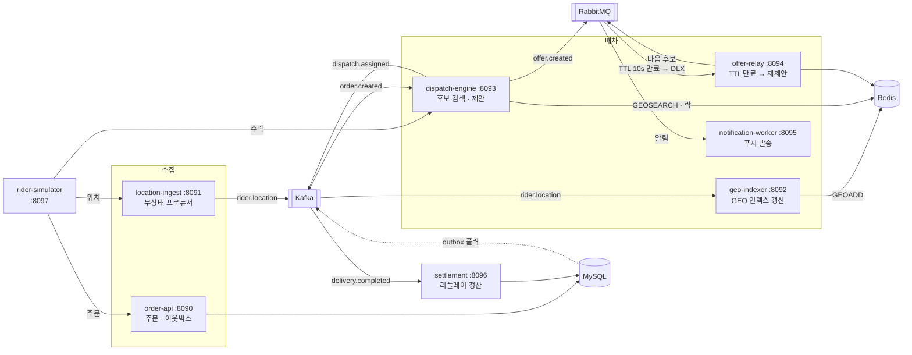
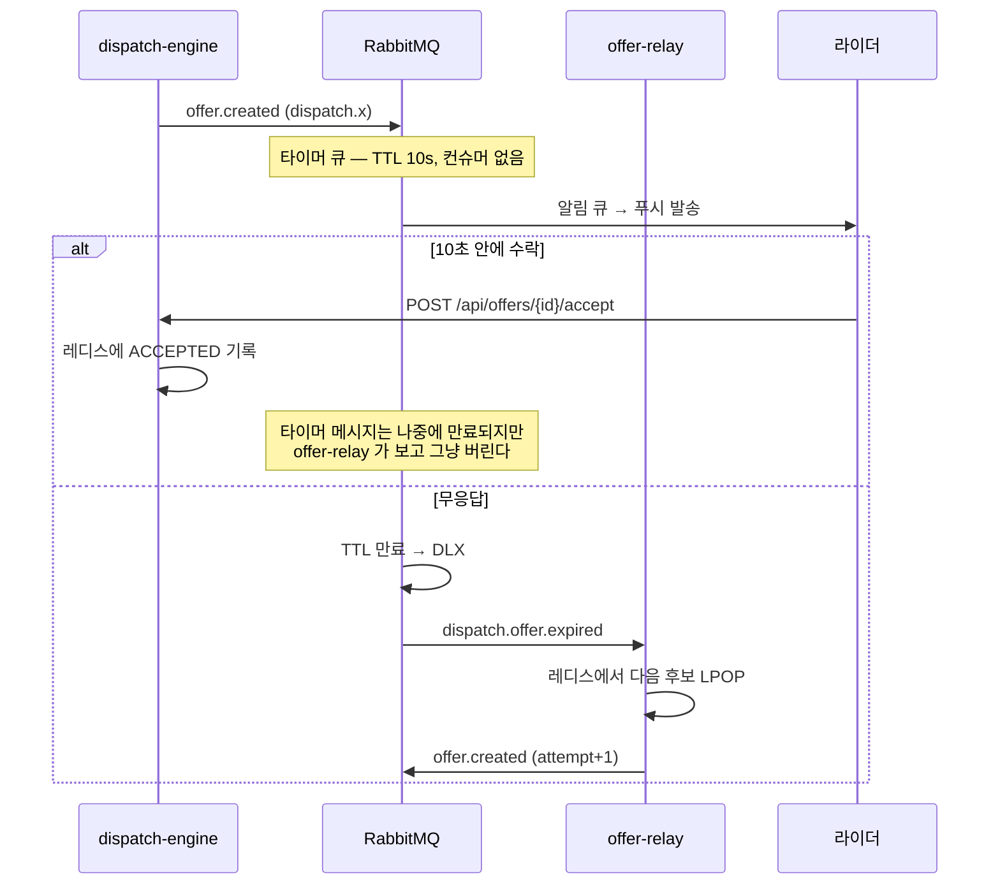

# Delivery System

라이더 수천 명이 3초마다 위치를 보내고, 주문이 들어오면 10초 안에 가장 가까운 라이더에게
배차를 제안하고, 안 받으면 다음 사람에게 넘기는 시스템.

기능 자체가 목표가 아니다. **카프카 · 레디스 · 래빗엠큐를 각자 대체 불가능한 자리에서 쓰고,
그 시스템을 로키 · 프로메테우스 · 템포로 들여다보면서, 서비스마다 다른 수평확장 전략을
직접 골라보는 것**이 목표다. 프론트엔드는 없다. 손잡이는 `rider-simulator` 와 그라파나다.

> **현재 상태: 0단계 — 뼈대만.** 서비스 8개가 `/hello` 만 응답한다.
> 무엇을 만들지는 [`.reference/functional-spec.md`](.reference/functional-spec.md) 에 기능 단위로,
> 어떤 순서로 만들지는 [`TODO.md`](TODO.md) 에 단계별로 적어뒀다.

## 왜 이 셋을 다 쓰나

| | 비유 | 이 프로젝트에서 | 없으면 |
|---|---|---|---|
| **Kafka** | 수도관 | 위치 스트림(초당 수천), 주문 이벤트 로그, 정산 리플레이 | 과거 이벤트를 다시 흘려 정산을 재계산할 방법이 없다 |
| **RabbitMQ** | 등기우편 | 배차 제안 — 특정 한 명에게, 10초 안에, 안 받으면 반송 | 10초 타이머를 컨슈머 코드로 직접 짜서 들고 있어야 한다. 그게 죽으면 다른 쪽이 이어받기까지 45초가 걸린다 |
| **Redis** | 책상 위 메모지 | GEO 반경 검색, 배차 락, 후보 목록, 레이트리밋, 멱등키 | 주문마다 DB 공간 인덱스를 때려서 DB 가 먼저 눕는다 |

일부러 반대로도 해본다 — 위치 스트림을 래빗엠큐로, 배차 제안을 카프카로.
두 번의 실패가 문서 100장보다 낫다 (`TODO.md` 2단계).
위치 스트림을 래빗엠큐로 보내본 결과는 [`.reference/tech-choice.md`](.reference/tech-choice.md) 2절에,
배차 제안을 카프카로 보내본 결과는 3절에, 후보 검색을 MySQL 공간 인덱스로 해본 결과는 4절에,
배차 상태를 MySQL 로 옮겨본 결과는 5절에 있다. 다섯 번을 한 장으로 모은 건 6절이다.

## 어떻게 흐르나



배차 제안 부분만 따로 보면 이렇다. 이게 래빗엠큐를 쓰는 이유 전부다.



타이머 큐에 컨슈머를 붙이면 안 된다. 바로 꺼내가면 TTL 이 흐를 틈이 없어서
"10초 안에 안 받으면 다음 사람" 규칙 자체가 사라진다.

주문 하나가 들어와서 정산까지 가는 동안 무엇이 어디로 흐르는지, 동시에 눌렀을 때 뭐가 꼬이는지,
브로커가 죽으면 어떻게 되는지는 시나리오 13개로 따로 정리해뒀다.
[`.reference/flow-scenarios.md`](.reference/flow-scenarios.md)

## 서비스

| 서비스 | 포트 | 하는 일 | 확장 특성 |
|---|---|---|---|
| `order-api` | 8090 | 주문 접수, 아웃박스 발행, 상태 조회 | DB 커넥션풀이 천장 |
| `location-ingest` | 8091 | 위치 수신 → 카프카 발행 | 무상태, 선형 확장 (시나리오 A) |
| `geo-indexer` | 8092 | 위치 소비 → 레디스 GEO 갱신 | 파티션 수가 천장 (시나리오 B) |
| `dispatch-engine` | 8093 | 후보 검색 · 점수 계산 · 제안 발행 | 락 경합으로 역효과 (시나리오 D) |
| `offer-relay` | 8094 | 만료 제안 수신 → 다음 후보 재제안 | 래빗엠큐 토폴로지 소유자 |
| `notification-worker` | 8095 | 푸시/SMS 발송 | 외부 API 가 병목 (시나리오 C) |
| `settlement-service` | 8096 | 배달 완료 리플레이로 정산 | 오프셋 리셋 실습장 |
| `rider-simulator` | 8097 | 라이더/주문 트래픽 생성 | 프론트 대신 쓰는 손잡이 |

네 시나리오의 자세한 내용은 [`.reference/scaling-scenarios.md`](.reference/scaling-scenarios.md).

## 관측

앱은 OTLP 한 곳(`:4317`)으로만 쏜다. 어디로 보낼지는 수집기가 정한다.

```
앱 (OTel 자바 에이전트)
      │ OTLP
      ▼
OTel Collector ──── traces ───▶ Tempo   (tail sampling: 느린 배차는 전량, 나머지 10%)
      │        └─── logs ─────▶ Loki    (trace_id 가 로그에 박혀 있다)
      │        └─── metrics ──▶ :8889
      │
Prometheus ─── actuator 직접 스크레이프 (앱 8090~8097)
           ─── kafka-exporter (컨슈머 랙) · redis-exporter · rabbitmq :15692
           ◀── Tempo span-metrics remote_write (서비스 그래프)
      │
      ▼
   Grafana  ── 메트릭 ⇄ 트레이스 ⇄ 로그 왕복
```

메트릭만 수집기를 안 거치고 프로메테우스가 직접 긁는다. 두 경로로 중복 수집하면
같은 지표가 두 벌 생겨서 나중에 어느 쪽이 진짜인지 헷갈린다.

## 실행

```bash
./scripts/start.sh          # 인프라 → 토픽 → 빌드 → 서비스 8개
./scripts/status.sh         # 상태 한 화면

# 헬로월드 확인
for p in 8090 8091 8092 8093 8094 8095 8096 8097; do curl -s localhost:$p/hello; echo; done

./scripts/scale.sh geo-indexer 4    # 인스턴스 4개로 (8092, 8192, 8292, 8392)
./scripts/stop.sh                   # 서비스만 종료 (컨테이너 유지)
STOP_INFRA=true ./scripts/stop.sh   # 전부 종료
```

스크립트 사용법은 [`scripts/README.md`](scripts/README.md).

> `scripts/*` 는 JDK 21 을 알아서 찾아 쓴다. `./gradlew` 를 직접 부를 때는
> `JAVA_HOME="$(/usr/libexec/java_home -v 21)" ./gradlew build` 처럼 붙여야 한다 —
> 이 맥의 기본 JDK 가 8이라 그냥 부르면 Boot 플러그인이 "requires JVM 17" 로 튕긴다.

### 접속 주소

| | 주소 | 계정 |
|---|---|---|
| Grafana | http://localhost:3001 | 익명 Admin |
| Prometheus | http://localhost:9099 | |
| Kafka UI | http://localhost:9091 | |
| RabbitMQ 관리 UI | http://localhost:15672 | dev_user / dev_password |
| RedisInsight | http://localhost:5541 | |
| Tempo | http://localhost:3200 | |
| Loki | http://localhost:3100 | |
| MySQL | localhost:33306 | dev_user / dev_password (db `delivery`) |
| Redis | localhost:6380 | |
| Kafka | localhost:9094 | |

포트를 전부 비켜 잡았다 — `social-discovery` 같은 다른 프로젝트를 같이 띄워도 안 부딪히게.

## 카프카 토픽

`infra/create-topics.sh` 가 명시 생성한다. broker auto-create 는 꺼둔 상태다 —
켜두면 파티션 1개로 만들어져서 "인스턴스를 늘렸는데 처리량이 안 늘어난다" 실험이 성립하지 않는다.

| 토픽 | 파티션 | 키 | 보관 |
|---|---|---|---|
| `rider.location` | 6 | riderId | 30분, lz4 |
| `order.created` | 6 | orderId | 7일 |
| `order.status` | 6 | orderId | 7일 |
| `dispatch.assigned` | 6 | orderId | 7일 |
| `dispatch.failed` | 3 | orderId | 7일 |
| `delivery.completed` | 6 | orderId | 7일 |

## 래빗엠큐 토폴로지

| 익스체인지 | 큐 | 특징 |
|---|---|---|
| `dispatch.x` | `dispatch.offer.timer` | TTL 10s + DLX, **컨슈머 없음** (알람시계) |
| `dispatch.x` | `dispatch.offer.notify` | 푸시 발송용 |
| `dispatch.dlx` | `dispatch.offer.expired` | offer-relay 가 소비 → 재제안. 자신도 DLX 를 건다 |
| `dispatch.dlx` | `dispatch.offer.expired.dlq` | 재제안을 3회 재시도해도 실패한 것 |
| `notify.x` | `notify.push` | `x-max-priority=10` (배차 제안 9, 마케팅 1) |
| `notify.dlx` | `notify.push.dlq` | 재시도 소진분 |

이름은 `libs/common` 의 `RabbitTopology` 에 모아뒀고, 선언도 같은 모듈의 `RabbitTopologyConfig`
가 자동설정으로 한다. 기능 정의서에는 `offer-relay` 가 선언한다고 돼 있는데, 그러면
`dispatch-engine` 이 먼저 뜰 때 큐가 없어서 제안이 에러도 없이 사라진다.

만료 큐에까지 DLX 를 건 이유는 그냥 버리면 그 주문이 재제안을 영영 못 받아서다. 보드에는
`EXPIRED` 가 남고 타이머는 이미 없으니 아무도 다시 안 건드린다. 손님 화면에는 "배차 중" 이
계속 떠 있고 그걸 알아챌 사람이 없다.

> **이미 있는 큐에 인자를 새로 붙이면 선언이 거절된다.** 위의 DLX 를 추가했을 때 실제로 겪었다.
> 브로커가 `PRECONDITION_FAILED` 를 내는데 **앱은 멀쩡히 뜬다.** 채널만 닫히고 그 큐에 리스너가
> 안 붙어서, 겉보기엔 정상인데 만료 제안이 한 건도 처리되지 않는다.
> 확인은 `rabbitmqctl list_queues name messages consumers` 로 하고, 만료 큐의 `consumers` 가
> 0이면 큐를 지우고 다시 띄운다 (인자는 나중에 못 바꾼다).

## 레디스 키

| 키 | 자료구조 | 용도 |
|---|---|---|
| `riders:online` | GEO | 온라인 라이더 위치 — `GEOSEARCH` 로 후보 검색 |
| `rider:state:{id}` | Hash | status, lat, lng, lastSeenAt, idleSince, currentOrderId, offerId |
| `riders:heartbeat` | ZSET | 마지막 좌표 수신 시각. 오프라인 정리가 이걸 훑는다 |
| `dispatch:candidates:{orderId}` | List | 점수순 후보. `LPOP` 으로 다음 사람 |
| `dispatch:offer:{orderId}` | Hash | 진행 중 제안 상태 |
| `dispatch:offer:by-id:{offerId}` | String | `offerId` → `orderId` 역인덱스 |
| `lock:dispatch:{orderId}` | String | `SET NX PX` 배차 락 |
| `dispatch:outbox` | List | 레디스 아웃박스. 수락 Lua 가 ACCEPTED 를 쓰면서 배차 확정 이벤트를 같이 넣는다 |
| `dispatch:outbox:inflight` | List | 꺼내서 카프카로 보내는 중인 것. 보내다 죽으면 여기 남았다가 다시 나간다 |
| `lock:rider:{riderId}` | String | 라이더 중복 제안 방지 |
| `lock:sweep:offline` | String | 오프라인 정리를 한 번에 한 대만 돌리는 락. 값은 잡은 인스턴스 |
| `idem:order:{key}` | String | 주문 멱등키 |
| `rate:push` | 토큰버킷 | 푸시 API 전역 레이트리밋 |

`libs/common` 의 `RedisKeys` 를 반드시 거치게 한다. 문자열로 흩뿌리면 나중에 누가 쓰는지 못 찾는다.

키마다 무엇을 막으려고 있는지, 락 두 개가 어떻게 역할을 나누는지, `GEOSEARCH` 안에서 실제로
무슨 일이 벌어지는지는 [`.reference/dispatch-internals.md`](.reference/dispatch-internals.md) 에 정리해뒀다.

## 기술 스택

Java 21 · Spring Boot 3.5.0 · Gradle 8.13 (Kotlin DSL, 멀티모듈)
MySQL 8.0 · Redis 7.4 · Kafka 7.6.1 (KRaft) · RabbitMQ 4
OpenTelemetry Collector · Prometheus 3 · Loki 3 · Tempo 2 · Grafana 11

## 디렉토리

```
delivery-system/
├── TODO.md                 앞으로 만들 것 (단계별)
├── libs/common/            토픽·큐·레디스 키 상수, 이벤트 레코드, JSON 유틸
├── services/               서비스 8개 (지금은 /hello 만)
├── infra/
│   ├── compose.yaml        저장소 · 메시징 · 관측 스택 전부
│   ├── create-topics.sh    파티션 수를 못 박은 토픽 생성
│   ├── otel/               수집기 파이프라인
│   ├── prometheus/         스크레이프 설정 + 확장 판단 룰
│   ├── loki/ tempo/        로그·트레이스 저장소 설정
│   ├── grafana/            데이터소스 프로비저닝 (메트릭⇄트레이스⇄로그 연결)
│   ├── mysql/ rabbitmq/    초기화 · 플러그인
│   └── .data/              컨테이너 볼륨 (gitignore)
├── scripts/                start · stop · status · logs · build · restart · scale
├── http/                   IntelliJ HTTP 클라이언트용 요청 모음
├── .reference/
│   ├── functional-spec.md     기능 정의서 (API, 규칙, 상태, 완료 조건)
│   ├── flow-scenarios.md      흐름 시나리오 13개 (정상, 동시성, 고장, 운영)
│   ├── dispatch-internals.md  dispatch-engine 과 레디스 사이 명령 단위 설계
│   └── scaling-scenarios.md   수평확장 시나리오 4개
├── logs/ pids/             런타임 산출물 (gitignore)
└── build.gradle.kts        subprojects 공통 설정
```
